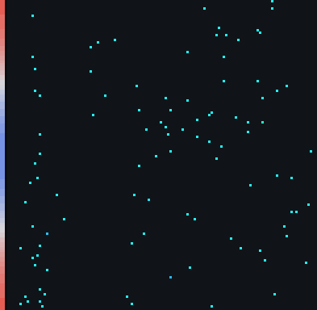
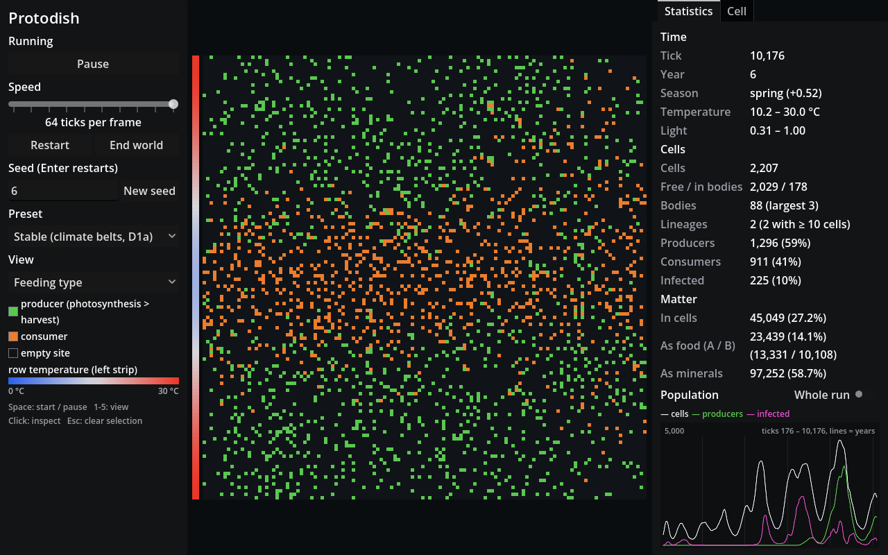
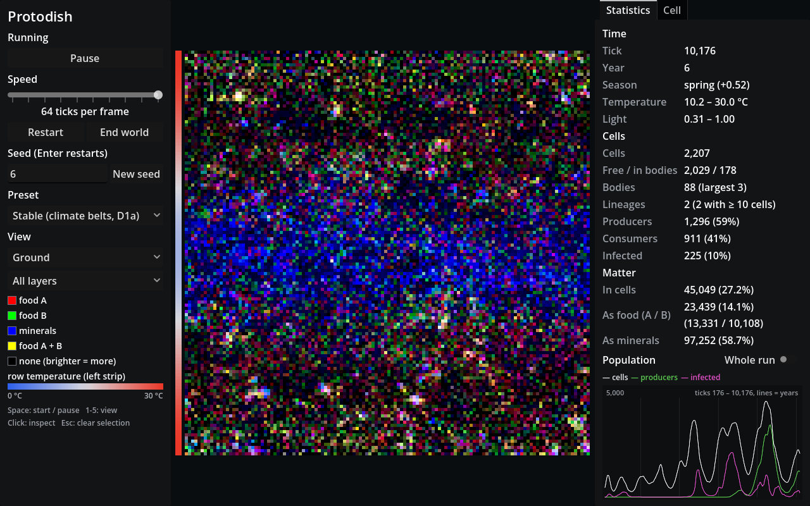
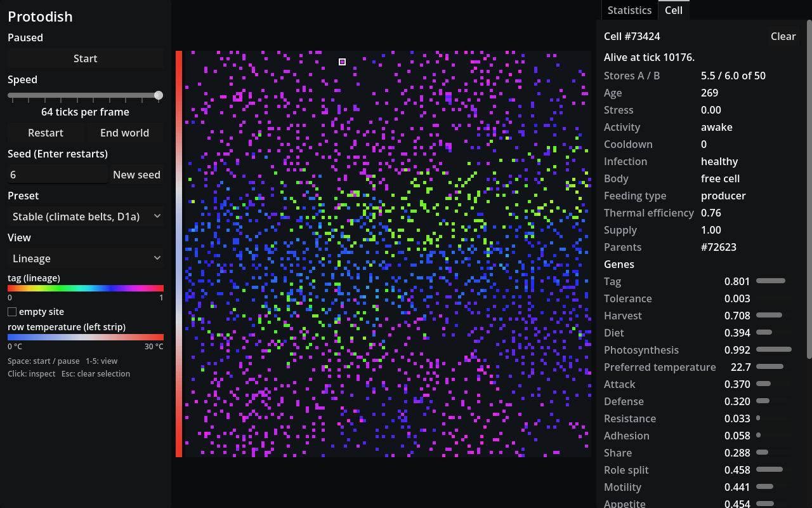
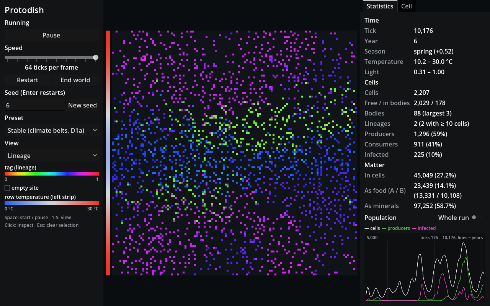

# Protodish

A grid-world artificial-life simulation, descended from Conway's Game of Life. No species,
predator, parasite or multicellular body is written into the rules. Every cell carries 20
genes, and those roles have to evolve.



*Lineage view: color is the cell's tag, a heritable marker. The strip on the left is each
row's temperature, which swings with the seasons. Stable preset, seed 6, 12,800 ticks.*

## What it is

- **A sealed world.** A 128 × 128 grid with wrapping edges. Its matter is fixed and only
  changes form: food A, food B, minerals and living cells. Only light enters: random sparks
  and photosynthesis turn minerals back into food.
- **Local rules only.** A cell senses at most 2 sites away and acts only on its 8 neighbors.
  Each tick it senses, moves, feeds, attacks, shares, catches viruses, pays upkeep and
  divides.
- **Nothing to start with but a generalist.** Every run starts from 50 identical cells that
  eat food and clone themselves. Photosynthesis, attack, armor, virus resistance, bodies,
  sharing, sex and dormancy all start at zero and must arise by mutation.
- **Seasons and climate.** A year is 2,000 ticks. Temperature and light depend on the row
  (latitude) and the season.
- **Replayable.** One seed drives all randomness, so the same seed gives the same history.

The full rule set is in [RULES.md](RULES.md). It is the specification the engine is built to.

| Feeding type | Ground | Inspecting a cell |
| --- | --- | --- |
|  |  |  |
| Producers (photosynthesis above harvest) in green, consumers in orange | Food A in red, food B in green, minerals in blue | Click a cell to follow it and see its genes |



## Download and run

Downloads are on the [Releases page](https://github.com/PradeepkrishnaGM/protodish/releases).
The app needs a graphics card with OpenGL 3.3.

- **Linux:** download `Protodish-<version>-x86_64.AppImage`, then
  `chmod +x Protodish-*.AppImage` and run it. If your system has no FUSE, run it with
  `--appimage-extract-and-run`.
- **Windows:** unzip `Protodish-<version>-windows-x86_64.zip` and run `Protodish.exe`. Keep
  it next to the `.dll`, which holds the simulation. The program is unsigned, so the first
  time Windows shows an "unknown publisher" warning: choose **More info**, then **Run anyway**.

  **Smart App Control.** On Windows 11 with Smart App Control turned on, Windows blocks
  unsigned programs outright and offers no "Run anyway". The only way to run Protodish is to
  turn Smart App Control off (Windows Security → App & browser control). On many Windows 11
  versions it cannot be turned back on without reinstalling Windows, so decide whether
  that is worth it. Windows 10 has no Smart App Control.

Options can follow `--` on the command line, for example
`./Protodish-*.AppImage -- --preset stable_d1a --seed 6 --speed 16 --view 3`:

| Option | Meaning |
| --- | --- |
| `--seed N` | Start with seed N (default 1) |
| `--preset NAME` | `default` (RULES.md values) or `stable_d1a` (stronger climate belts) |
| `--view N` | View 1–5, as the keys below |
| `--speed N` | Ticks per frame: 1, 2, 4, …, 64 |

## Controls

| Control | What it does |
| --- | --- |
| **Start / Pause**, or **Space** | Runs or freezes the world |
| **Speed** | From 1 tick every 8 frames up to 64 ticks per frame |
| **Restart** | A new world from the seed in the field. Enter in the field does the same |
| **New seed** | Restarts with a random seed |
| **End world** | Clears every cell; their matter falls to the ground as food |
| **Preset** | Loads a set of parameters and restarts: Default (RULES.md) or Stable (climate belts) |
| **View**, or keys **1–5** | Lineage, Energy, Feeding type, Infection, Ground. Ground can also show one layer at a time |
| **Click** on the world | Follows a cell in the Cell tab, or shows an empty site's ground and climate |
| **Esc** | Clears the selection |

The Statistics tab shows the tick, year and season, temperature and light, cells, bodies,
lineages, producers and consumers, infections, where the matter is, and a population graph
(last 5 years, or the whole run). There is no rewind: the world only runs forward.

## What we found

Tuning ran 186 runs of 50,000 ticks (25 years) over 22 parameter sets. A run counts as
**balanced** when it meets the four targets in RULES.md: it lasts, it stays diverse (at least
3 lineages of 10 or more cells), producers and consumers both exist, and the yearly peaks
stay within a factor of 3. The details are in [TUNING.md](TUNING.md), and every decision
about the rules is in [DECISIONS.md](DECISIONS.md).

**What works**

- **Roles evolve from nothing.** Photosynthesis rises from 0 to about 0.7–0.9 in 10,000
  ticks, dormancy rises and falls with the seasons, and attack (predation) evolves in some
  runs.
- **Runs mostly last and cycle.** Under the RULES.md values, 20 of 24 runs survive 25 years,
  and 19 of 24 keep their yearly peaks within ×3 of each other (most survivors within ×2).
- **Viruses thin crowds without wiping them out.** Epidemics come and go at the default rate,
  and none caused an extinction.
- **Stronger climate belts** (the Stable preset) gave 0 extinctions in 24 runs, against 4 of 24
  with the defaults.

**What doesn't work yet**

- **No run is balanced: 0 of 24.** Diversity fails in every run. Usually one lineage
  holds the world.
- **Tags are neutral, so lineages don't stay apart.** Two lineages that differ only in
  tag compete as equals, and one wins within one or two winters. Splits that last need a
  niche (a different diet or climate), and those arose in about 1 run in 12, never three at
  once. The run in the GIF is one of the lucky ones, with two.
- **"Both sides exist" passes, but weakly.** Most cells are generalists with harvest and
  photosynthesis both near 0.9, so the producer/consumer split is a small difference between
  two high genes.
- **Bodies stay small.** No setting tried produced a body larger than 19 cells. Anchored
  cells exhaust the food within their reach.
- **About 1 run in 6 dies** in a predator-prey crash in spring or summer.

Fixing these needs rule changes, not tuning: for example a rule that creates lasting niches,
or a way for inner cells of a body to feed. TUNING.md lists the candidates.

## Building from source

Requirements: CMake 3.20 or newer, Ninja, a C++20 compiler (tested with GCC 12, 13 and 15),
and Python 3 for the tools. The app also needs [Godot 4.7](https://godotengine.org).

```sh
git clone --recurse-submodules https://github.com/PradeepkrishnaGM/protodish.git
cd protodish
```

**Core, command-line runner and tests** (no Godot needed):

```sh
cmake -S . -B build -G Ninja
ninja -C build
ctest --test-dir build -LE slow    # quick checks; plain `ctest` also runs the long invariant runs
./build/evolve --seed 1 --ticks 50000 --census run.csv
```

`evolve --help` lists the options. `--params FILE` overrides any rule parameter
(`--dump-params` prints them all), and `--lineage FILE` writes the birth and death log. The
scripts in `tools/` check a run against the four targets (`check_balance.py`), plot it
(`plot_run.py`, needs `pip install -r requirements.txt`) and run seeds in parallel
(`batch.py`).

**The app** (builds godot-cpp the first time, which takes a few minutes):

```sh
git submodule update --init        # if you cloned without --recurse-submodules
cmake -S . -B build-godot -G Ninja -DEVO_BUILD_GODOT=ON
ninja -C build-godot
godot --path godot
```

**Release builds** use the scripts in `packaging/` and run in GitHub Actions on version tags
(`.github/workflows/release.yml`). The Windows build is cross-compiled with MinGW-w64.

## Determinism

The same seed gives the same history on the same platform, and the tests check this
against recorded state hashes. Linux and Windows builds may differ in the last bits of
floating point, so a seed is not guaranteed to replay identically across platforms.

## License

MIT; see [LICENSE](LICENSE). The downloads include Godot Engine and other MIT-licensed
components; see [THIRD_PARTY.md](THIRD_PARTY.md).
